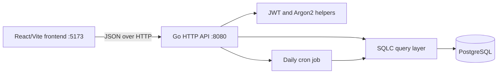

# Architecture

## Runtime components

The frontend and backend run as separate processes during development. The backend enables CORS for the Vite development origin. The commented file-server code in `internal/api/routes.go` is not currently active, so the Go server does not serve the frontend build.

## Backend layers

- `main.go` loads `.env`, opens PostgreSQL, constructs SQLC queries, starts the daily scheduler, applies CORS, and registers routes.
- `internal/api` contains HTTP handlers, route registration, response helpers, store interfaces, and handler tests.
- `internal/auth` contains password hashing, password comparison, JWT creation and validation, bearer-token parsing, and refresh-token generation.
- `internal/database` contains SQLC-generated types and query methods. The API depends on `UserStore` and `NoteStore` interfaces so handlers can be tested with fakes.
- `sql/queries` contains SQLC query definitions.
- `sql/schema` contains ordered PostgreSQL schema changes.
- `frontend/src` contains React views, route protection, and browser-side API calls.

## Request flow

1. The frontend sends JSON to the Go API.
2. Protected handlers parse the bearer token and validate its JWT signature using `JWT_SECRET`.
3. The JWT subject identifies the authenticated user.
4. Handlers call the store interfaces, which are backed by SQLC in production.
5. The handler maps database models to JSON response models.
6. The frontend stores the access token in local storage and uses it for protected requests.

## Data model

- `Users` stores identity, credentials, username, streak counters, and note counters.
- `Notes` stores note text and timestamps, and references `Users(id)` through `user_id`.
- `refresh_tokens` stores opaque refresh tokens, expiry, revocation time, and the owning user.
- Deleting a user cascades to their notes and refresh tokens.

The daily cron job runs at midnight UTC and resets every user's `today_count`. Creating a note increments the user's total and daily note counts and may update or reset the current streak.

## Frontend routes

The React router defines public login and registration screens plus protected profile, create-note, note-list, and read-note screens. `ProtectedRoute` checks for an access token in local storage before rendering protected pages; token validity is ultimately enforced by the API.
